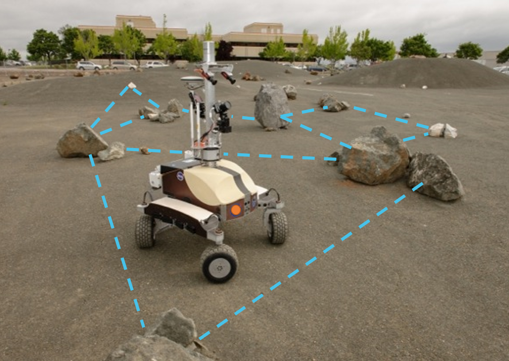

# Technion ANPL QSR-SLAM

Authors: Roee Mor.

QSR-SLAM is the first open-source qualitative geometry SLAM library.

This python based library implements sensor fusion for robotics and computer vision applications, including SLAM (Simultaneous Localization and Mapping), VO (Visual Odometry), and SFM (Structure from Motion). 

SLAM is about estimating position of landmarks in an unknown environment along with the trajectory of a robotic platform.
Qualitative geometry SLAM uses only qualitative geometric relations between objects (landmarks, and platform).
This is less accurate, but in some cases more robust, faster to compute and good enough for the task (especially with low quality sensors).

This is a python based library  enables using various sensor models and various qualitative geometry spatial partitions for qualitative SLAM inference.
We provide examples to run QSR-SLAM3 with a simple example data.

## 1) Related Publications:

---
[QSR-SLAM] Mor, Roee, and Vadim Indelman. "Probabilistic qualitative localization and mapping." 2020 IEEE/RSJ International Conference on Intelligent Robots and Systems (IROS). IEEE, 2020.‏

## 2) License

---
QSR-SLAM3 is released under MIT license. If you use QSR-SLAM3 in an academic work, please cite:

    @inproceedings{mor2020probabilistic,
        title={Probabilistic qualitative localization and mapping},
        author={Mor, Roee and Indelman, Vadim},
        booktitle={2020 IEEE/RSJ International Conference on Intelligent Robots and Systems (IROS)},
        pages={5009--5016},
        year={2020},
        organization={IEEE}
    }

## 3) Instalation

---
Install python 3.10 or later

make python env using requierments.txt

## 4) Instalation

---

working directory is src

    ./src

execute:

    $ python main test.py
